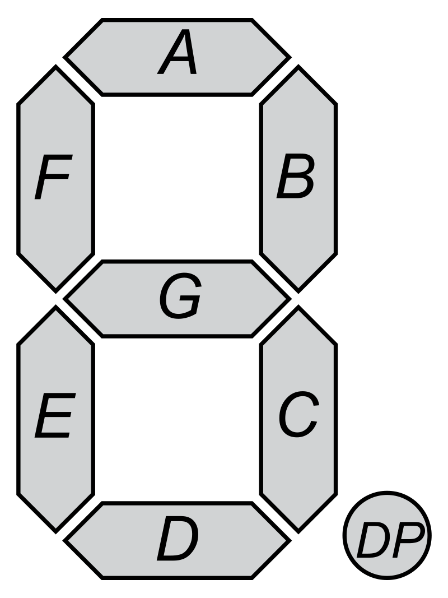

# FlipDigitPython

## Description

This library has for goal to control the [Small 7-segment displays](https://flipdots.com/en/products-services/small-7-segment-displays/) by alfazeta.

## Requirement

The only library needed for this to work is pyserial. Basic installation can be made like so:

```pip3 install pyserial```

or by using the provided requirments.txt file:

```pip3 install -r requirments.txt```

## How to use

### Simple digit

You can simply declare a FlipDigit like so:

```
from FlipDigit import *

# myDigit = FlipDigit('/dev/tty0') 	# Linux com port
myDigit = FlipDigit('COM6') 		# Windows com port
``` 

This use the default configuration of a digit: 9600 baud with adress set as 0xFF.

Then you can either send the data code to enable or not a segment following the pattern shown there:



The code is then going from _a_ for the lsb to _g_ for the msb

As example, a 0 is 0b111111 or 0x3F:

```
myDigit.set_segments(0x3F)
``` 

or  you can directly send the number you want like so:

```
myDigit.set_number(0)
``` 

Examples:
- [segment_example.py](./examples/segment_example.py)
- [number_example.py](./examples/number_example.py)

### Configuration

You can easily change the configuration of a digit like so:

``` 
myDigit = FlipDigit('COM6')	#we use a digit with default configuration

myDigit.set_serial_speed(SerialSpeed.S_115200)
myDigit.set_address(0x01)
``` 

The digit has now the address '1' and the baudrate is set to 115200 bauds.

Now the digit need to be used like so:

```
myDigit1 = FlipDigit('COM6',SerialSpeed.S_115200,0x01)
``` 

Examples:
- [config_example.py](./examples/config_example.py)

### Multiple digit

You can easily use multiple digit since they share a static serial attribute. Be careful, only the first digit serial configuration will be taken in account!

```
myDigit1 = FlipDigit('COM6',SerialSpeed.S_115200,0x01)
myDigit2 = FlipDigit('COM6',SerialSpeed.S_115200,0x02)

myDigit1.set_number(1)
myDigit2.set_number(2)
```

Examples:
- [multiple_digits.py](./examples/multiple_digits.py)

### Multiple digit in sync

In the previous example, the set_number is not made in sync. It is possible to send the set_number or set_segments and then have all the digit refreshed at the same time using the SyncMultipleFlipDigits object like so: 

```
myDigit1 = FlipDigit('COM6',SerialSpeed.S_115200,0x01)
myDigit2 = FlipDigit('COM6',SerialSpeed.S_115200,0x02)

mySyncDigits = SyncMultipleFlipDigits([myDigit1, myDigit2])
# now that the digits are part of a SyncMultipleFlipDigits, they won't be refreshed automatically


myDigit1.set_number(i)	 		
sleep(1)
myDigit2.set_number((i+1)%10)
sleep(1)

mySyncDigits.sync_refresh() # myDigit1 and myDigit2 are refreshed only here!

```

Examples:
- [multiple_sync_digits.py](./examples/multiple_sync_digits.py)


## License MIT

License
Copyright © 2021, Lucas Bonvin

Permission is hereby granted, free of charge, to any person obtaining a copy of this software and associated documentation files (the “Software”), to deal in the Software without restriction, including without limitation the rights to use, copy, modify, merge, publish, distribute, sublicense, and/or sell copies of the Software, and to permit persons to whom the Software is furnished to do so, subject to the following conditions:

The above copyright notice and this permission notice shall be included in all copies or substantial portions of the Software.

The Software is provided “as is”, without warranty of any kind, express or implied, including but not limited to the warranties of merchantability, fitness for a particular purpose and noninfringement. In no event shall the authors or copyright holders be liable for any claim, damages or other liability, whether in an action of contract, tort or otherwise, arising from, out of or in connection with the software or the use or other dealings in the Software.

Except as contained in this notice, the name of Lucas Bonvin shall not be used in advertising or otherwise to promote the sale, use or other dealings in this Software without prior written authorization from Lucas Bonvin.